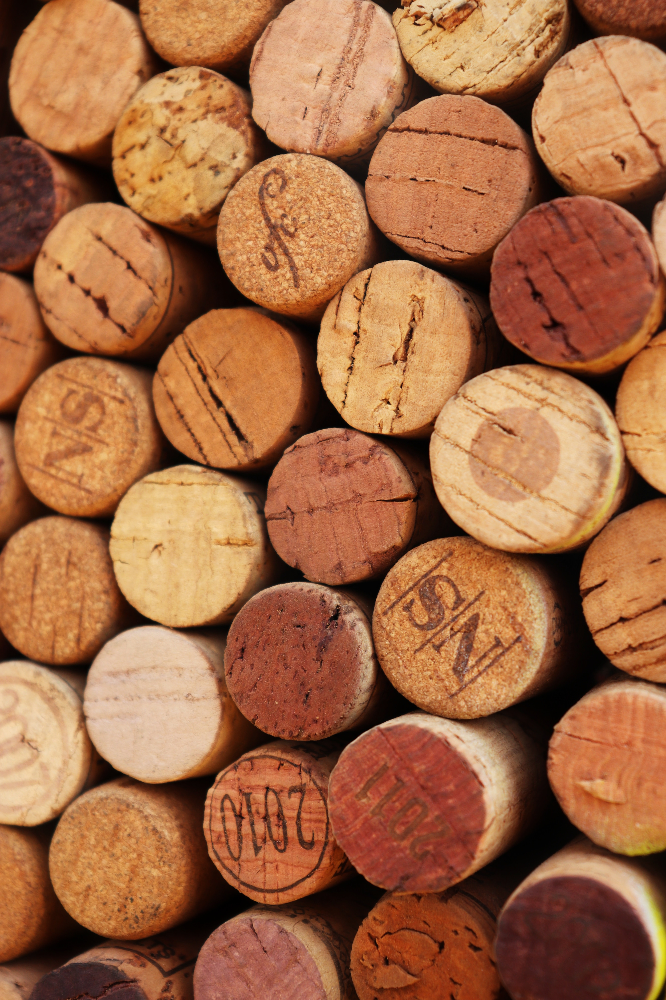

<!DOCTYPE html>
<html xmlns="http://www.w3.org/1999/xhtml" lang="en" xml:lang="en">
<head>
  <title>Wines of Italy</title>
  <meta http-equiv="Content-Type" content="text/html; charset=utf-8"/>
  <meta name="viewport" content="width=device-width, initial-scale=1.0"/>
  <link rel="preconnect" href="https://fonts.gstatic.com">
  <link href="https://fonts.googleapis.com/css2?family=Open+Sans&display=swap" rel="stylesheet">
  <link href="https://fonts.googleapis.com/css2?family=Open+Sans:wght@700&display=swap" rel="stylesheet">
  <link rel="stylesheet" href="style_sheet/stylesheet.css">
  <link rel="stylesheet" href="https://fonts.googleapis.com/icon?family=Material+Icons">
</head>

<body>

<header>

</header>

<!-- Search bar has been adapted from W3 Schools CSS search bar examples https://www.w3schools.com/howto/howto_css_searchbar.asp*/ -->
<form action="#" target="_self" method="get" class="search">
  <input type="search" name="search" placeholder="Search..." class="search__input"/>
  <button type="submit" class="search__button"><i class="material-icons md-light">search</i></button>
</form>
<!-- End of W3C Schools search bar adaptation -->

<!-- Navigation dropdown has been adapted from W3 Schools CSS navigation dropdown examples https://www.w3schools.com/howto/howto_css_dropdown.asp -->
<nav>
  <ul class="menu">
    <li class="dropdown"><a href="regions.html" role="button" class="dropbtn">Regions</a>
      

        <a href="#">Abruzzo</a>
        <a href="#">Basilicata</a>
        <a href="#">Calabria</a>
        <a href="#">Campania</a>
        <a href="#">Emilia Romagna</a>
        <a href="#">Friuli Venezia Giulia</a>
        <a href="#">Lazio</a>
        <a href="#">Liguria</a>
        <a href="#">Lombardia</a>
        <a href="#">Marche</a>
        <a href="#">Molise</a>
        <a href="italian_regions/piedmont.html">Piedmont</a>
        <a href="#">Puglia</a>
        <a href="#">Sardinia</a>
        <a href="italian_regions/sicily.html">Sicilia</a>
        <a href="italian_regions/veneto.html">Veneto</a>
        <a href="italian_regions/tuscany.html">Toscana</a>
        <a href="#">Trentino-Alto Adige</a>
        <a href="#">Umbria</a>
        <a href="#">Valle D'Aosta</a>
      

    </li>
    <li><a href="blog.html">Blog</a></li>
    <li><a href="resources.html">Resources</a></li>
  </ul>
    <i class="material-icons">menu</i>
</nav>

<!-- End of W3C Schools Navigation dropdown adaptation -->

<!--use first image for desktop, second image for tablet, third image for mobile-->

  <figure>
    
    
    
  </figure>

<footer>
  <h6> &#169; 2020 David Zamperin</h6>
</footer>

</body>

</html>
